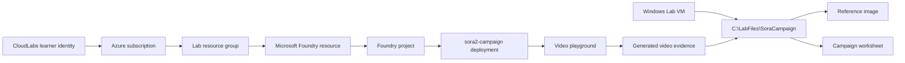

# Getting Started: Generate AI Video Campaigns with Sora 2 in Microsoft Foundry

### Estimated Duration: 5 minutes

## Scenario

You are a campaign content producer on a sustainability-focused marketing team. Your team is preparing a short launch campaign for an eco-friendly reusable water bottle named **EcoSip**. In this 60-minute lab, you will use the pre-provisioned **Sora 2** deployment in **Microsoft Foundry** to generate, refine, and evaluate short AI-generated video assets.

The lab is portal-first. You will not build an application or write API code. You will work in the Microsoft Foundry **Video playground**, save prompt notes and evidence, and choose the most campaign-ready asset.

## Lab timing

| Section | Target time | Outcome |
|---|---:|---|
| Getting Started | 5 min | Understand the environment, files, and safety rules |
| Exercise 1 | 10 min | Verify the existing **sora2-campaign** deployment and open the Video playground |
| Exercise 2 | 20 min | Generate and refine a text-to-video campaign clip |
| Exercise 3 | 22 min | Generate an image-guided variation and evaluate campaign readiness |
| Final validation | 3 min | Confirm required evidence is saved |
| **Total** | **60 min** | Campaign evidence package complete |

> [!Important]
> The Sora 2 deployment is already provisioned for you by the lab deployment. In Exercise 1, you will verify and open the existing **sora2-campaign** deployment. Do not create a second Sora deployment unless your instructor explicitly asks you to troubleshoot a failed deployment.

## Objectives

By the end of this lab, you will be able to:

- Open a prepared Microsoft Foundry project and locate the existing Sora 2 deployment.
- Use the **sora2-campaign** deployment in the Microsoft Foundry **Video playground**.
- Generate a baseline text-to-video campaign clip.
- Improve a prompt with subject, setting, lighting, camera motion, duration, and campaign constraints.
- Use a supplied product reference image to create an image-guided video variation.
- Evaluate generated clips for prompt adherence, product consistency, campaign fit, and responsible AI compliance.

## Sign in

Use the credentials provided for this CloudLabs environment.

1. Open a browser on the Lab VM.
2. Go to <https://portal.azure.com>.
3. Sign in with:
   - Username: <inject key="AzureAdUserEmail"></inject>
   - Password: <inject key="AzureAdUserPassword"></inject>
4. If prompted to stay signed in, select **Yes**.
5. Confirm you are in subscription <inject key="SubscriptionID"></inject> and tenant <inject key="TenantID"></inject>.
6. Open the Microsoft Foundry portal at <https://ai.azure.com>.

> [!Tip]
> If Microsoft Foundry asks you to choose a directory, subscription, resource, or project, use the values shown in `C:\LabFiles\SoraCampaign\deployment-info.json` on the Lab VM.

## Prepared resources

The lab deployment creates the Azure and local resources you need before you start. Your CloudLabs deployment identifier is part of the lab-specific resource naming, for example **sora-campaign-<inject key="DeploymentID" enableCopy="false"/>**.

| Resource or item | What you use it for |
|---|---|
| Azure subscription | Hosts the prepared Microsoft Foundry and Azure OpenAI resources |
| Resource group | Contains the lab resources for this run |
| Microsoft Foundry resource and project | Portal workspace for opening the deployed Sora 2 model |
| Sora 2 deployment named **sora2-campaign** | The video model deployment you use throughout the lab |
| Windows Lab VM | Browser access, local lab files, worksheet, and validation scripts |
| Local lab folder | Stores the reference image, worksheet, and evidence files |

You will verify the resource and project names in Exercise 1. The expected deployment name is always **sora2-campaign**.

## Lab files

Use this folder throughout the lab:

`C:\LabFiles\SoraCampaign`

The folder contains:

| Path | Purpose |
|---|---|
| `C:\LabFiles\SoraCampaign\Images\EcoBottle-Reference.png` | Rights-cleared product mockup image with no human faces |
| `C:\LabFiles\SoraCampaign\Evidence\` | Save downloaded videos, screenshots, and evidence files here |
| `C:\LabFiles\SoraCampaign\Campaign-Worksheet.md` | Record prompts, observations, and final campaign selection |
| `C:\LabFiles\SoraCampaign\deployment-info.json` | Prepared resource names and portal entry information |

> [!Important]
> Generated videos are retained for a limited time in the service experience. Download videos or save screenshots/evidence before the lab ends.

## Microsoft Foundry entry point

Use Microsoft Foundry for all model and video work:

1. Go to <https://ai.azure.com>.
2. Select the prepared directory and subscription if prompted.
3. Open the prepared Microsoft Foundry project.
4. Navigate to **Build**.
5. Select **Models** or **Models + endpoints** from the left navigation. Preview UI labels can vary.
6. Select the deployed Sora 2 model deployment named **sora2-campaign**.
7. Select **Open in playground** to open the **Video playground**.

In the Video playground, you will enter prompts, adjust available generation controls such as duration and aspect ratio, generate videos, compare results, and save evidence.

## Responsible AI quick read

Sora 2 video generation in Microsoft Foundry uses Azure OpenAI safety systems, including content filtering and moderation. Prompts, uploaded images, or generated outputs can be rejected when they violate policy.

For this lab:

- Use only the supplied product image or another image you have rights to use.
- Do not use real people, public figures, faces, celebrity likenesses, copyrighted characters, copyrighted music, trademarks, or logos.
- Keep prompts suitable for all audiences.
- Keep the campaign focused on a neutral product scene: bottle, surface, light, camera motion, sustainable setting, and visual style.
- If a generation is rejected, revise the prompt toward neutral product, environment, camera, lighting, and motion details.
- Do not upload images containing human faces. The supplied `EcoBottle-Reference.png` is intended to avoid that issue.

> [!Note]
> Sora 2 is currently treated as a preview capability in this lab. Portal labels, available controls, model availability, and generation timing can change. Follow the lab instructions first, and use the closest matching Microsoft Foundry UI label when the portal text differs slightly.

## Architecture

### Component overview

- **CloudLabs learner identity**: The account you use to sign in to Azure and Microsoft Foundry.
- **Azure subscription and resource group**: The hosted lab environment created for this run.
- **Microsoft Foundry resource and project**: The portal workspace where the video model deployment is available.
- **sora2-campaign deployment**: The ARM-provisioned Sora 2 deployment used for all video generation tasks.
- **Video playground**: The no-code Microsoft Foundry experience for prompt iteration and video generation.
- **Windows Lab VM**: Your working desktop for browser access, worksheet editing, and local evidence collection.
- **C:\LabFiles\SoraCampaign**: The local folder that contains the supplied product image and stores your lab evidence.

## Expected result before Exercise 1

Before you continue, you should have:

- Signed in to Azure with the provided CloudLabs user.
- Opened Microsoft Foundry at <https://ai.azure.com>.
- Identified the local lab folder `C:\LabFiles\SoraCampaign`.
- Understood that **sora2-campaign** already exists and will be verified in Exercise 1.
- Reviewed the responsible AI constraints for prompts and image uploads.

## After publishing

> [!Note] These steps run **after** you push the template to CloudLabs — they verify CloudLabs can actually serve this lab guide to candidates.

- **Verify docs-proxy access:** open Templates → your template → **Lab Guide Settings** in <https://admin.cloudlabs.ai> and confirm CloudLabs can reach this repo via the docs proxy. If the repo is private, configure GitHub access at the template level.
- **Verify inline questions and inline validations:** sign in to <https://admin.cloudlabs.ai>, open your template, and walk through one full lab run to confirm every `<question>` and `<validation step="..."/>` renders correctly. Fix any that don't resolve.
